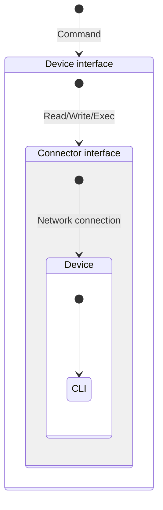
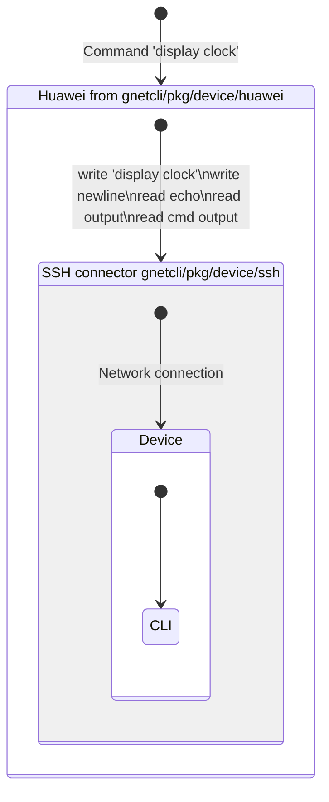

Gnetcli
======
The ultimate solution for CLI automation in Golang. It provides a universal way to execute arbitrary commands using CLI.

## Installation

`go get -u github.com/annutil/gnetcli`

## Quick Start

```go
package main

import (
	"context"
	"time"

	"go.uber.org/zap"

	"github.com/annutil/gnetcli/pkg/cmd"
	"github.com/annutil/gnetcli/pkg/credentials"
	"github.com/annutil/gnetcli/pkg/device"
	"github.com/annutil/gnetcli/pkg/device/huawei"
	"github.com/annutil/gnetcli/pkg/streamer/ssh"
)

func main() {
	host := "somehost"
	password := "mypassword"
	ctx, cancel := context.WithTimeout(context.Background(), 30*time.Second)
	defer cancel()
	logConfig := zap.NewDevelopmentConfig()
	logger := zap.Must(logConfig.Build())

	creds := credentials.NewSimpleCredentials(
		credentials.WithUsername(credentials.GetLogin()),
		credentials.WithPassword(credentials.Secret(password)),
		credentials.WithSSHAgent(),
		credentials.WithLogger(logger),
	)
	connector := ssh.NewStreamer(host, creds, ssh.WithLogger(logger))
	dev := huawei.NewDevice(connector) // huawei CLI upon SSH
	_ = dev.Connect(ctx)               // connection happens here
	defer dev.Close()
	res, _ := dev.Execute(cmd.NewCmd("display interfaces"))
	if res.Status() == 0 {
		fmt.Printf("Result: %s\n", res.Output())
	} else {
		fmt.Printf("Error: %s\nStatus: %d\n", res.Status(), res.Error())
	}
}
```

## Feature Overview:
- Pager, questions and error handling are supported. 
- Netconf is supported.
- SSH tunnels is supported.
- Basic terminal evaluation.
- CLI and GRPC-server to interact with non-go projects and other automations.

## Usages

### As CLI

```shell
cli_go -hostname myhost -devtype huawei -debug -command $'dis clock\ndis ver0' -password $password -json
```

```json
[
  {
    "output": "2023-10-29 10:00:00\nSunday\nTime Zone(UTC) : UTC\n",
    "error": "",
    "status": 0,
    "cmd": "dis clock"
  },
  {
    "output": "",
    "error": "              ^\nError: Unrecognized command found at '^' position.\n",
    "status": 1,
    "cmd": "dis ver0"
  }
]
```

### As GRPC-server
```shell
go run gnetcli/cmd/server/server.go 
```

### As library

<table>
<thead>
  <tr>
    <th>Gnetcli way</th>
    <th>Expect way</th>
  </tr>
</thead>
<tbody><tr>
<td>

```go
creds := credentials.NewSimpleCredentials(credentials.WithSSHAgent())
connector := ssh.NewStreamer(host, creds)
dev := cisco.NewDevice(connector)
_ = dev.Connect(ctx)
// executing
res, _ := dev.Execute(cmd.NewCmd(*command))
fmt.Printf("result:\n %s\ncmd status: %d\ncmd err: %s", 
	res.Output(), res.Status(), res.Error())
```

</td>
<td>

```go
sshClt, err := ssh.Dial("tcp", host, &ssh.ClientConfig{
  User:            user,
  Auth:            []ssh.AuthMethod{ssh.PublicKeys()},
})
e, _, err := expect.SpawnSSH(sshClt, timeout)
// executing
e.Expect(promptRE, timeout)
e.Send(cmd1 + "\n")
e.Expect(regexp.MustCompile(cmd1+"\r\n"), timeout) // drop cmd echo
res, _, _ := e.Expect(promptRE, timeout)
fmt.Printf("result:\n %s\n", res) // res contains prompt
```

</td>
</tr></tbody></table>

The CLI can be quite a wild beast – often lacking documentation, not designed for machines, unstructured, and intended for terminals. Although writing an expect-like program to execute a predetermined command or sequence of commands is a relatively straightforward task, creating generic code for arbitrary commands proves to be the more challenging endeavor.


The CLI offers only write and read abstractions, so executing a command involves a series of write and read operations. Depending on the CLI context, user's permissions, and even the weather on Mars, CLI responses to your input can vary greatly. It might ask a question, generate output with a pager and wait for a key press, or produce errors. Additionally, CLI output includes echoes from input commands and terminal control characters.


Gnetcli is no miracle, as it relies on pattern recognition. Consequently, each CLI type must be properly described beforehand. Defining an expression for a prompt is a must.


## Complex examples:
```go
package main

import (
	"context"
	"time"

	"go.uber.org/zap"

	"github.com/annutil/gnetcli/pkg/cmd"
	"github.com/annutil/gnetcli/pkg/credentials"
	"github.com/annutil/gnetcli/pkg/device"
	"github.com/annutil/gnetcli/pkg/device/huawei"
	"github.com/annutil/gnetcli/pkg/streamer/ssh"
)

func main() {
	host := "somehost"
	changeUser := "target_login"
	newPass := "newpassword"
	logConfig := zap.NewDevelopmentConfig()
	logger := zap.Must(logConfig.Build())

	creds := credentials.NewSimpleCredentials(
		credentials.WithUsername(credentials.GetLogin()),
		credentials.WithPassword(credentials.Secret("mypassword")),
		credentials.WithSSHAgent(),
		credentials.WithLogger(logger),
	)

	ctx, cancel := context.WithTimeout(context.Background(), 30*time.Second)
	defer cancel()

	connector := ssh.NewStreamer(host, creds, ssh.WithLogger(logger))
	dev := huawei.NewDevice(connector)
	err := dev.Connect(ctx)

	_, err = dev.Execute(cmd.NewCmd("system-view"))
	if err != nil {
		logger.Fatal("system-view error", zap.Error(err))
	}
	_, _ = dev.Execute(cmd.NewCmd("aaa"))
	_, _ = dev.Execute(cmd.NewCmd("local-user "+changeUser+" password",
		cmd.WithAnswers(
			cmd.NewAnswer("Enter Password:", newPass),
			cmd.NewAnswer("Confirm Password:", newPass),
		),
	))
	_, _ = dev.Execute(cmd.NewCmd("commit"))
}
```

## Architecture

Gnetcli differentiates CLI abstraction and transport abstraction so it possible to implement some vendor's CLI and use it over SSH, telnet, console etc...

<table>
<thead>
  <tr>
    <th>Abstract</th>
    <th>Implementation</th>
  </tr>
</thead>
<tbody><tr style="vertical-align: top;">
<td>



</td>
<td>



</td>
</tr></tbody></table>

The `Device`interface represents high-level abstractions to execute commands and do other tasks on a device.
`Device` is the cornerstone of the project, you must always use it instead of a concrete types. 

The interface `Connector` implements low-level interaction with a device, like SSH, telnet, console...

Gnetcli provides `Device` implementation called `GenericCLI`which uses regular expressions to identify prompt, questions, errors, and so on.
There are also included several implementations like Cisco, Huawei, Juniper, etc.
Unfortunately, these implementations may not be ideal because they, as they were created based on limited usage of a specific device, specific logins, commands, and software version.
Consequently, your experience may differ, and the implementations might not work function properly.
