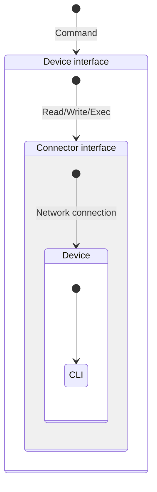
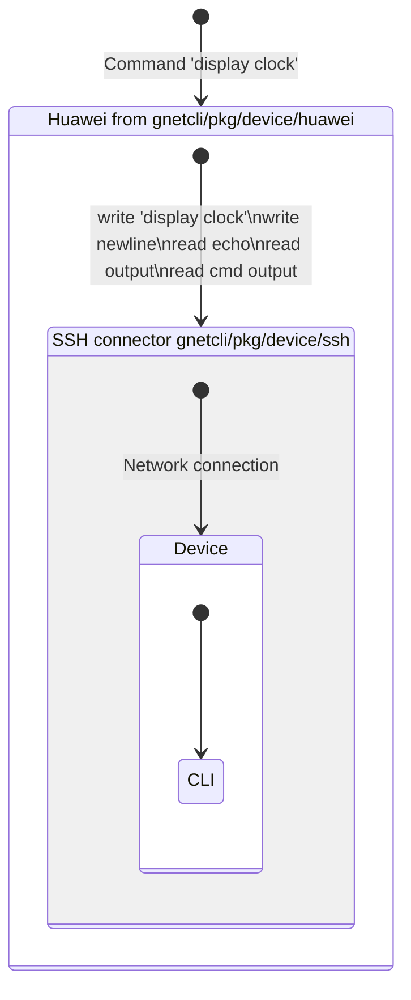

## Architecture

### Comparison with expect

<table>
<thead>
  <tr>
    <th>Gnetcli way</th>
    <th>Expect way</th>
  </tr>
</thead>
<tbody><tr>
<td>

```go
creds := credentials.NewSimpleCredentials()
connector := ssh.NewStreamer(host, creds)
dev := cisco.NewDevice(connector)
_ = dev.Connect(ctx)
// executing
res, _ := dev.Execute(cmd.NewCmd(*command))
fmt.Printf("result:\n %s\ncmd status: %d\ncmd err: %s", 
	res.Output(), res.Status(), res.Error())
```

</td>
<td>

```go
sshClt, err := ssh.Dial("tcp", host, &ssh.ClientConfig{
  User:            user,
  Auth:            []ssh.AuthMethod{ssh.PublicKeys()},
})
e, _, err := expect.SpawnSSH(sshClt, timeout)
// executing
e.Expect(promptRE, timeout)
e.Send(cmd1 + "\n")
e.Expect(regexp.MustCompile(cmd1+"\r\n"), timeout) // drop cmd echo
res, _, _ := e.Expect(promptRE, timeout)
fmt.Printf("result:\n %s\n", res) // res contains prompt
```

</td>
</tr></tbody></table>

### Challenges

The CLI can be quite a wild beast – often lacking documentation, not designed for machines, unstructured, and intended for terminals. Although writing an expect-like program to execute a predetermined command or sequence of commands is a relatively straightforward task, creating generic code for arbitrary commands proves to be the more challenging endeavor.

The CLI offers only write and read abstractions, so executing a command involves a series of write and read operations. Depending on the CLI context, user's permissions, and even the weather on Mars, CLI responses to your input can vary greatly. It might ask a question, generate output with a pager and wait for a key press, or produce errors. Additionally, CLI output includes echoes from input commands and terminal control characters.

Gnetcli is no miracle, as it relies on pattern recognition. Consequently, each CLI type must be properly described beforehand. Defining an expression for a prompt is a must.

Gnetcli differentiates CLI abstraction and transport abstraction so it possible to implement some vendor's CLI and use it over SSH, telnet, console etc...

<table>
<thead>
  <tr>
    <th>Abstract</th>
    <th>Implementation</th>
  </tr>
</thead>
<tbody><tr style="vertical-align: top;">
<td>



</td>
<td>



</td>
</tr></tbody></table>

The `Device`interface represents high-level abstractions to execute commands and do other tasks on a device.
`Device` is the cornerstone of the project, you must always use it instead of a concrete types.

The interface `Connector` implements low-level interaction with a device, like SSH, telnet, console...

Gnetcli provides `Device` implementation called `GenericCLI`which uses regular expressions to identify prompt, questions, errors, and so on.
There are also included several implementations like Cisco, Huawei, Juniper, etc.
Unfortunately, these implementations may not be ideal because they, as they were created based on limited usage of a specific device, specific logins, commands, and software version.
Consequently, your experience may differ, and the implementations might not work function properly.

### Development

### CLI support using regular expressions (genericcli.GenericCLI)
To support a new vendor, it is necessary to define a set
of regular expressions that dissect the output of the device:

* Prompt (`PromptExpression`), For example, `<some-device>`.
  The expression should be as precise as possible to avoid mismatch of the output.
* Error lines (for example, typo or lack of privileges) (`ErrorExpression`).
* Pager (`PagerExpression`). For example, `---- More ----`.

Optional:

* Login/password input strings (`LoginExpression`, `PasswordExpression`, `PasswordErrorExpression`).
  Relevant in the case where the transport does not provide authentication, e.g. telnet.
* Questions (`QuestionExpression`).
  For example, the device asks if it is worth continuing the action.


The terminal works such that we see what the remote terminal wrote back, not what had entered.
That is why we cannot see the password during entering it.

genericcli package read command echo explicitly, preventing it from falling into the result of a command.
As such, there are no regularities for echo reading, but expression for echo is automatically generated 
based on calculations that echo more or less matches the entered string. 
If your case is more complex, you can override `GenericCLI.echoExprFormat`.

#### What interaction with a device looks like:
<style>
.mono {
  font-family: monospace;
}
.direction {
  color: green; 
  font-family: monospace;
}
.odd {
  background-color:rgba(0, 0, 0, 0.2);
}
.term {
  color: red;
  font-family: monospace;
}
</style>
<div style="display: grid; row-gap: 1px; grid-template-columns: 2fr 2fr 3fr;">
  <div><b>Terminal</b></div>
  <div><b>Raw data</b></div>
  <div><b>Description</b></div>

  <div style="grid-column: span 3;">Authentication in telnet.</div>

  <div class="odd"><span class="direction"> <<< </span><span class="term">Username:</span></div>
  <div class="odd"><span class="mono">Username:</span></div>
  <div class="odd">Login prompt. Using LoginExpression.</div>

  <div><span class="direction"> >>> </span><span class="term">myname</span></div>
  <div><span class="mono">myname\n</span></div>
  <div>Login entered</div>

  <div class="odd"><span class="direction"> <<< </span><span class="term"></span></div>
  <div class="odd"><span class="mono">myname\r\n</span></div>
  <div class="odd">Echo of entered login</div>

  <div><span class="direction"> >>> </span><span class="term">Password:</span></div>
  <div><span class="mono">Password:</span></div>
  <div>Password prompt. PasswordExpression must match it</div>

  <div class="odd"><span class="direction"> >>> </span><span class="term"></span></div>
  <div class="odd"><span class="mono">mypassword\n</span></div>
  <div class="odd">Password entered</div>

  <div><span class="direction"> <<< </span><span class="term"></span></div>
  <div></div>
  <div>No echo from entered password, or it is replaced with *. PasswordErrorExpression may be used to detect auth error.</div>

  <div style="grid-column: span 3;">Command execution</div>

  <div class="odd"><span class="direction"> <<< </span><span class="term">&lt;hostname&gt;</span></div>
  <div class="odd"><span class="mono">&lt;hostname&gt;</span></div>
  <div class="odd">It is a prompt. Must be matched by PromptExpression.</div>

  <div><span class="direction"> >>> </span><span class="term">dis version</span></div>
  <div><span class="mono">dis version\n</span></div>
  <div>Write 'dis version' command</div>

  <div class="odd"><span class="direction"> <<< </span><span class="term"></span></div>
  <div class="odd"><span class="mono">dis version\r\n</span></div>
  <div class="odd">Echo of the command</div>

  <div><span class="direction"> <<< </span><span class="term">version</span></div>
  <div><span class="mono">version:\r\n</span></div>
  <div>Command result</div>

  <div class="odd"><span class="direction"> <<< </span><span class="term">&lt;hostname&gt;</span></div>
  <div class="odd"><span class="mono">&lt;hostname&gt;</span></div>
  <div class="odd">Prompt</div>

  <div style="grid-column: span 3;">Command output with pager</div>

  <div class="odd"><span class="direction"> >>> </span><span class="term">dis log</span></div>
  <div class="odd"><span class="mono">dis log\n</span></div>
  <div class="odd">Write 'dis log' command</div>

  <div><span class="direction"> <<< </span><span class="term"></span></div>
  <div><span class="mono">dis log\r\n</span></div>
  <div>Echo of the command</div>

  <div class="odd"><span class="direction"> <<< </span><span class="term">line</span></div>
  <div class="odd"><span class="mono">line\r\n</span></div>
  <div class="odd">Command result</div>

  <div><span class="direction"> <<< </span><span class="term">  ---- More ----</span></div>
  <div><span class="mono">  ---- More ----</span></div>
  <div>Awaiting for user input. Must be matched by PagerExpression.</div>

  <div class="odd"><span class="direction"> >>> </span><span class="term">Enter</span></div>
  <div class="odd"><span class="mono">\n</span></div>
  <div class="odd">Write Enter</div>

  <div><span class="direction"> <<< </span><span class="term"></span></div>
  <div><span class="mono">\u001b[16D                \u001b[16D</span></div>
  <div>Drop '---- More ----' from the output</div>

  <div class="odd"><span class="direction"> <<< </span><span class="term">line2</span></div>
  <div class="odd"><span class="mono">line2\r\n</span></div>
  <div class="odd">Command result</div>

  <div><span class="direction"> <<< </span><span class="term">&lt;hostname&gt;</span></div>
  <div><span class="mono">&lt;hostname&gt;</span></div>
  <div>Prompt</div>
</div>

Example of regular expression for Huawei CE:
```go
const (
	huaweiLoginExpression         = `.*Username:$`
	huaweiQuestionExpression      = `\n(?P<question>.*Continue\? \[Y/N\]:)$`
	huaweiPromptExpression        = `.*<(?P<prompt>[\w\-]+)>$`
	huaweiErrorExpression         = `(\^\r\nError: (?P<error>.+) at '\^' position\.|Error: You do not have permission to run the command or the command is incomplete)`
	huaweiPasswordExpression      = `.*Password:$`
	huaweiPasswordErrorExpression = `.*Error: Username or password error\.\r\n$`
	huaweiPagerExpression         = `\r\n  ---- More ----$`
)
```

To create Device implementation, you need to define a constructor function that combines a Connector and a set of CLI templates:

```go
func NewHuaweiDevice(connector streamer.Connector) GenericDevice {
	cli := MakeGenericCLI(expr.NewSimpleExpr(huaweiPromptExpression), expr.NewSimpleExpr(huaweiErrorExpression),
		WithLoginExprs(
			expr.NewSimpleExpr(huaweiLoginExpression),
			expr.NewSimpleExpr(huaweiPasswordExpression),
			expr.NewSimpleExpr(huaweiPasswordErrorExpression)),
		WithPager(
			expr.NewSimpleExpr(huaweiPagerExpression)),
		WithQuestion(
			expr.NewSimpleExpr(huaweiQuestionExpression)),
	)
	return MakeGenericDevice(cli, connector)
}
```

`GenericDevice` can (and should be) used if the algorithm of working with vendors CLI is not very different from the "classic" vendors, i.e., it is enough to specify a set of regular expressions in the prompt.

#### Custom Device
If the algorithm of working with vendors CLI is very complex, then you will have to implement the `Device` interface to work with a device.

```go
// see current interface int device.go
type Device interface {
	Connect(ctx context.Context) error
	Execute(command gcmd.Cmd) (gcmd.CmdRes, error)
	Download(paths []string) (map[string]streamer.File, error)
	Upload(paths map[string]streamer.File) error
	Close()
	GetAux() map[string]any
}
```
So you need to implement how to connect to the device, how you process sending a command and receiving a result, 
and how you close the connection.

#### Testing
##### Regexp
Checking regular expressions on specific cases. The most important step in implementing a vendor CLI.

```go
package huawei

import (
  "testing"

  "github.com/annetutil/gnetcli/pkg/testutils"
)

func TestHuaweiErrors(t *testing.T) {
  errorCases := [][]byte{
    []byte("             ^\r\nError: Unrecognized command found at '^' position.\r\n"),
    []byte("\r\nError: You do not have permission to run the command or the command is incomplete.\r\n"),
    []byte("Error: Unrecognized command found at '^' position."),
    []byte("Error: No permission to run the command."),
    []byte("Error: You do not have permission to run the command or the command is incomplete."),
    []byte("Error: Invalid file name log."),
    []byte("              ^\r\nError[1]: Unrecognized command found at '^' position."),
    []byte("              ^\r\nError[2]: Incomplete command found at '^' position."),
    []byte("                                   ^\r\nError:Too many parameters found at '^' position."),
  }
  testutils.ExprTester(t, errorCases, errorExpression)
}

func TestHuaweiPrompt(t *testing.T) {
  errorCases := [][]byte{
    []byte("\r\n<ce8850-test>"),
    []byte("\r\n[~host-name]"),
    []byte("\r\n[*host-name-aaa]"),
    []byte("\r\n[~hostname-1-100GE11/0/25]"),
  }
  testutils.ExprTester(t, errorCases, promptExpression)
}

func TestHuaweiNotPrompt(t *testing.T) {
  errorCases := [][]byte{
    []byte("\r\n local-user username password irreversible-cipher ..cut..:SL<->"),
  }
  testutils.ExprTesterFalse(t, errorCases, promptExpression)
}

func TestHuaweiQuestion(t *testing.T) {
  errorCases := [][]byte{
    []byte("\r\nWarning: The current configuration will be written to the device. Continue? [Y/N]:"),
  }
  testutils.ExprTester(t, errorCases, questionExpression)
}

```


##### Scenarios check
There is an "internal/mock" package, which includes Mock SSH server, 
and a set of helper functions ("Action") to describe the tests according to the scripts:

- `Expect` - expects to receive from the clients
- `Send` - strings that will be sent to clients
- `SendEcho` - alias for "Send". It is used to make the code more readable 
in cases where the server sends a command back to the clients.
- `Close` - closes the connection

The Mock SSH server accepts scripts like:

```go
dialog: []m.Action{
	m.Send("<some-device>"),
	m.Expect("dis ver\n"),
	m.SendEcho("dis ver\r\n"),
	m.Send("" +
		"Huawei Versatile Routing Platform Software\r\n" +
		"VRP (R) software, Version 8.180 (CE8850EI V200R005C10SPC800)\r\n" +
		"Copyright (C) 2012-2018 Huawei Technologies Co., Ltd.\r\n" +
		"5. CPLD2  Version : 101\r\n" +
		"6. BIOS   Version : 192\r\n",
	),
	m.Send("<some-device>"),
	m.Close(),
}

sshServer, err := m.NewMockSSHServer(dialog)
```

The essence of the scenario is the complete repetition of communications with the device.  
To create such a scenario, you need to study in detail the process of sending data from the device,
particularly the special characters \r, \n and others. You can see raw data in the debug output of the gnetcli package.

It makes sense to test both valid and interactions with an error.
Valid scenario include executing existing commands and use the `RunDialog` function. 
Scenario with an error includes commands with a typo or a command for which the user does not have 
enough privileges and use the `RunErrorDialog` function instead.

##### Sequence of actions to implement via GenericDevice
Decide on the access method. Usually, this is SSH, and it usually implements 
authentication itself. If authentication is required, see `deviceWithLoginExpr()`.

Create `device/myvendor/device.go` with the content bellow in your project and replace myvendor with vendor name.

```go
package mydevice

import (
  "github.com/annetutil/gnetcli/pkg/device/genericcli"
  "github.com/annetutil/gnetcli/pkg/expr"
  "github.com/annetutil/gnetcli/pkg/streamer"
  "github.com/annetutil/gnetcli/pkg/device"
)

const (
  promptExpression        = `.*<(?P<prompt>[\w\-]+)>$`
  errorExpression         = `You do not have permission to run the command or the command is incomplete`
  questionExpression      = `\r\n(?P<question>.*Continue\?)$`
  pagerExpression         = `\r\n  ---- More ----$`
)

func NewDevice(connector streamer.Connector, opts ...genericcli.GenericDeviceOption) genericcli.GenericDevice {
  cli := genericcli.MakeGenericCLI(
    expr.NewSimpleExpr(promptExpression),
    expr.NewSimpleExpr(errorExpression),
    genericcli.WithPager(
      expr.NewSimpleExpr(pagerExpression),
    ),
    genericcli.WithQuestion(
      expr.NewSimpleExpr(questionExpression),
    ),
  )
  return genericcli.MakeGenericDevice(cli, connector, opts...)
}
```

Create tests for regular expressions as described above.
Take the [example](https://github.com/annetutil/gnetcli/blob/main/examples/simple_exec/main.go) and change it,
so it uses newly create Device from `myvendor.NewDevice()`.

Go through the cases listed below and modify tests and device expressions. 
These are not an exhaustive list but a guideline based on our experience working with vendors.
* `myvendorPromptExpression`
    * Prompt for regular user.
    * Prompt for administrator.
    * Prompt in configuration mode.
    * Prompt in configuration mode being in specific block of configuration.
    * Prompt in configuration mode with uncommited changes.
* `myvendorErrorExpression`
    * Insufficient number of arguments.
    * Extra argument.
    * Wrong type of argument.
    * Unknown command.
    * Insufficient rights for command.
* `myvendorQuestionExpression`
    * Reboot confirmation.
    * Config saving confirmation.
* `myvendorPagerExpression`
    * Long command.
    * More than one page - it may show percents in pager.

It is important to check not only if the regular expression finds what is needed but also 
if it does not find what is not needed. As an example, the expression `<[\w-]+>` can 
match part of the output configuration "user hash: 1234->56".
And lastly, reading from the device may be character-per-character, and therefore you 
should not depend on the end of the line.


#### Development and testing on virtual devices

You can use virtual devices to play with the project. For example let's start qfx from vrnetlab:
```shell
docker run -it -p 2222:22 -p 2223:23 -p 5000:5000 --privileged aninchat/vr-vqfx:19.4R1.10
```

```shell
cli -hostname localhost -port 2222 -devtype juniper -command $'ping non exists\nshow configuration system syslog | display set' -login vrnetlab -password VR-netlab9 -json -debug | jq .
```
